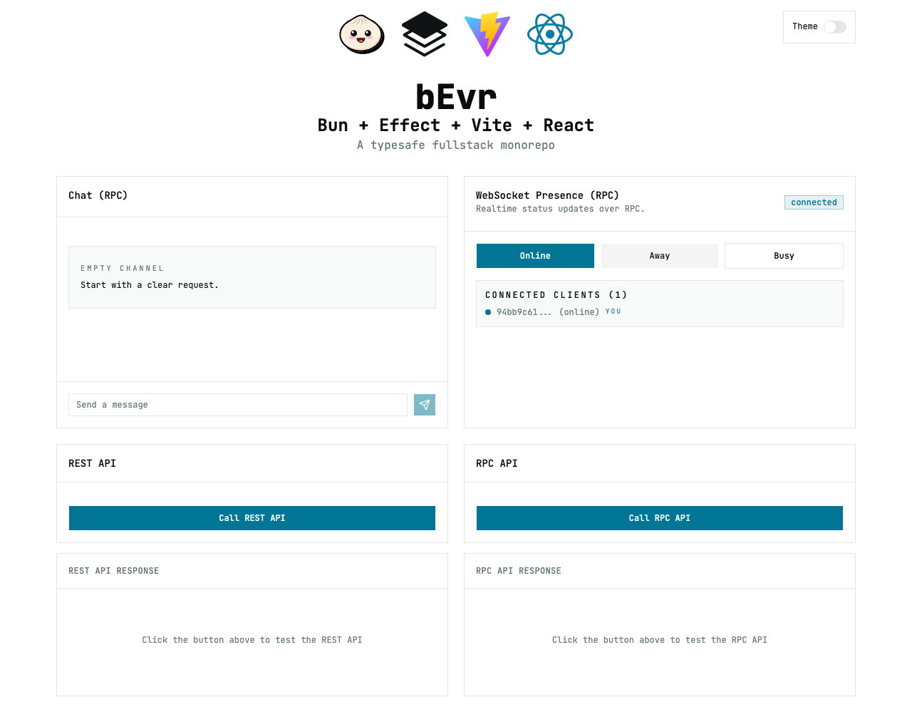

# edu_effect-rag-builder

An experimental AI/RAG toolkit monorepo for exploring different retrieval
pipelines, sources, and interaction patterns. Built with Bun, Effect, Vite, and
React for end-to-end type safety and fast iteration.



## What It Is

- **RAG-first experiments**: Try different ingestion, chunking, retrieval, and
  evaluation strategies without rebuilding the stack
- **Chat + agents**: Streaming chat flows with tool-driven workflows
- **Shared domain**: Effect Schema types shared across client and server
- **Modern TypeScript stack**: Bun, Vite, React, Effect, Turborepo
- **Optional observability**: OpenTelemetry wiring when env vars are set

## Features

- **End-to-end TypeScript**: Full type safety from client to server
- **RAG pipeline building blocks**: Schemas and RPC endpoints to iterate on
  retrieval approaches
- **Streaming UX**: UI and RPC for chat and agent workflows
- **Zero config DX**: Biome linting/formatting, Turbo builds, Bun runtime
- **Flexible deployment**: Docker compose for local experiments

## Quick Start

```bash
# Install dependencies
bun install

# Start development
bun dev

# Build for production
bun run build
```

### Local ChromaDB (Docker)

For local dev, run the ChromaDB container and point the server at it:

```bash
# Start the ChromaDB service only
docker run -d --name edu_chroma -p 8000:8000 chromadb/chroma

# In another shell, run the server with ChromaDB env vars
CHROMA_HOST=localhost CHROMA_PORT=8000 bun dev --filter=server
```

ChromaDB will be available at `http://localhost:8000`.

### Formatting and Linting

Format and lint the codebase using Ultracite:

```bash
# Format code
bun format

# Lint code
bun lint

# Type check
bun run type-check
```

### Testing

Run tests across the monorepo:

```bash
# Run all unit tests
bun run test

# Run tests for specific apps
bun run test --filter=client
bun run test --filter=server

# Run E2E and visual regression tests
bun run test:e2e

# Update visual regression baselines
bun run test:e2e -- --update-snapshots
```

### Test Stack

- **Client**: Vitest 4.x with Browser Mode (Playwright), vitest-browser-react
- **Server**: Vitest 4.x with Node environment, @effect/vitest
- **E2E**: Playwright with visual regression testing

### CI/CD Workflows

This repo currently ships with local dev and test scripts. Add CI workflows when
you are ready to stabilize experiment paths.

## Project Structure

```txt
.
├── apps/
│   ├── client/             # React demo UI (Vite + React)
│   └── server/             # Bun + Effect backend API
├── e2e/                     # Playwright end-to-end tests
├── packages/
│   ├── ai/                 # AI services and toolkits
│   ├── config-typescript/  # TypeScript configurations
│   ├── domain/             # Shared Schema definitions
│   └── observability/      # OpenTelemetry setup
├── docker-compose.yaml     # Docker Compose configuration for deployment
├── package.json            # Root package.json with workspaces
└── turbo.json              # Turborepo configuration
```

### Apps

| App      | Description                                                            |
| -------- | ---------------------------------------------------------------------- |
| `client` | Demo UI for RAG experiments and chat flows                             |
| `server` | Effect Platform API for ingestion, retrieval, and chat/agent workflows |

### Packages

| Package                   | Description                                                                                    |
| ------------------------- | ---------------------------------------------------------------------------------------------- |
| `@repo/config-typescript` | TypeScript configurations used throughout the monorepo                                         |
| `@repo/domain`            | Shared schemas and RPC contracts for ingestion, retrieval, and chat flows                      |
| `@repo/ai`                | AI tooling and service layers built on [@effect/ai](https://github.com/tim-smart/effect-io-ai) |
| `@repo/observability`     | Shared OpenTelemetry setup                                                                     |

## Development

```bash
# Start development server
bun dev
# Run specific app
bun dev --filter=client
bun dev --filter=server


# Build all apps
bun run build
```

## Deployment

To run the application using Docker, you can use the provided
`docker-compose.yaml` file.

First, ensure you have Docker and Docker Compose installed on your system.

Then, run the following command to build and start the services in the
background:

```bash
docker-compose up -d --build
```

This will start the `client` and `server` services.

### Environment Variables

You can configure the deployment using environment variables:

```bash
# Example .env file
CLIENT_PORT=3000
SERVER_PORT=9000
ANTHROPIC_API_KEY=your_key_here
```

## Type Safety

Import shared types from the domain package:

```typescript
import { ApiResponse } from "@repo/domain/Api";
```

## Notes For Experiments

- The RAG pipeline is intentionally modular. Swap sources, chunking strategies,
  or embedding models as you iterate.
- The demo client is expected to evolve quickly. Update snapshots if UI changes
  are intentional.

## Learn More

- [Turborepo](https://turborepo.com/docs)
- [Effect](https://effect.website/docs/introduction)
- [Vite](https://vitejs.dev/guide/)
